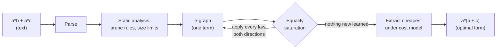

<div align="center">

# Logic-Loom

### A compiler that understands *mathematics*, not just instructions.

[](https://pypi.org/project/logic-loom/)
[](https://pypi.org/project/logic-loom/)
[](https://github.com/elianalfonsolopezpreciado/Logic-Loom/blob/main/LICENSE)
[](#correctness)

Most optimizers shuffle instructions. Logic-Loom reasons about algebra. It
discovers that `a*b + a*c` **is** `a*(b + c)`, finds Horner's scheme on its
own, cancels `a*(b+c) - a*b` down to `a*c`, optimizes for a chosen hardware
target, tracks the domain assumptions it relies on, refuses to disturb side
effects, and emits the result as C, Rust, JavaScript or LLVM IR.

```bash
pip install logic-loom
```

[Quick start](#quick-start) ·
[Use cases](#use-cases) ·
[Showcase](#showcase) ·
[How it works](#how-it-works) ·
[Cost models](#hardware-aware-cost-models) ·
[Domain safety](#domain-safety-and-assumptions) ·
[Side effects](#side-effect-awareness) ·
[Code generation](#code-generation) ·
[Correctness](#correctness) ·
[Limitations](#limitations) ·
[Roadmap](#roadmap)

</div>

---

## The idea

A traditional compiler optimizes by pattern-matching *instructions*: replace a
multiply-by-two with a shift, fold two constants, peephole away a redundant
move. It reads code like a clerk with a checklist.

Logic-Loom reads code like a **mathematician**. Given

```
a*b + a*c
```

it does not ask *"which instruction is cheaper?"* It recognizes the
**distributive law** and rewrites the algorithm:

```
a*(b + c)        # one multiply instead of two
```

It does this not with a hand-written branch for every case, but by knowing a
handful of algebraic *laws* and exploring all of their consequences at once,
then picking the cheapest equivalent form under a configurable cost model. The
same engine that factors a sum also discovers Horner's scheme for polynomials
and cancels terms that destroy each other; none of it was special-cased.

> **The technique:** *equality saturation* over an *e-graph*, the same idea
> behind [`egg`](https://egraphs-good.github.io/) and the
> [Herbie](https://herbie.uwplse.org/) floating-point optimizer. See
> [How it works](#how-it-works).

---

## Quick start

No dependencies. Pure Python (3.9+).

```bash
pip install logic-loom
```

Then use it from the command line:

```bash
# optimize an expression
logic-loom "a*b + a*c"
#  a * b + a * c  =>  a * (b + c)

# the module form works too
python -m logic_loom "a*b + a*c"

# optimize for a hardware target and emit LLVM IR
python -m logic_loom --profile gpu --target llvm "a/b + c/b"

# track the domain assumptions a simplification relies on
python -m logic_loom --extended --explain "sqrt(x)*sqrt(x)"
#  sqrt(x) * sqrt(x)  =>  x
#    assumes (for soundness): ?x >= 0

# respect side effects: do not collapse two random draws into zero
python -m logic_loom --impure rand "rand(s) - rand(s)"
#  rand(s) - rand(s)  ==  rand(s) - rand(s)
```

From Python:

```python
from logic_loom import optimize, to_code

r = optimize("a*x*x + b*x + c")
print(r.optimized)              # x * (a * x + b) + c     <- Horner's scheme
print(r.speedup)               # 1.32
print(to_code(r.optimized, "c"))
```

Or run from a source checkout (and try the full showcase):

```bash
git clone https://github.com/elianalfonsolopezpreciado/Logic-Loom.git
cd Logic-Loom
pip install -e .
python examples/demo.py
```

---

## Showcase

Every row below is produced by the **same** engine and the **same** rule set;
nothing is special-cased. `cost` is the weighted operation count under the
default model.

| Input | Logic-Loom output | What it figured out | Cost |
|---|---|---|---|
| `a*b + a*c` | `a * (b + c)` | distributive law / factoring | 5.4 -> 3.3 |
| `p*q + p*r + p*s` | `p * (q + (r + s))` | factor a term shared by three products | 8.6 -> 4.4 |
| `a*x*x + b*x + c` | `x * (a*x + b) + c` | **Horner's scheme, discovered** | 8.6 -> 6.5 |
| `a*(b + c) - a*b` | `a * c` | expand, then cancel `a*b` | 6.5 -> 2.2 |
| `2*3 + 4*x*0 + a*1` | `6 + a` | constant folding + identities | 10.7 -> 1.2 |
| `2*x + 3*x` | `x * 5` | combine like terms | 5.4 -> 2.2 |
| `x + 0 - x + 5` | `5` | self-inverse vanishes | 3.4 -> 0.1 |
| `x/x + y - y` | `1` | division and subtraction cancel | 6.4 -> 0.1 |
| `(a+b)/c + (a-b)/c` | `(a + a) / c` | combine over a denominator | 11.6 -> 5.3 |

Run `python examples/demo.py` to reproduce all of these with live statistics.

---

## Use cases

Logic-Loom is a small, dependency-free engine you can drop into any Python
program. A few concrete things people use this kind of tool for:

**Speed up a hot numeric kernel.** Factor repeated work out of an inner loop and
evaluate polynomials with fewer multiplies (Horner), then read off the cheaper
formula:

```python
from logic_loom import optimize
print(optimize("a*x*x + b*x + c").optimized)   # x * (a * x + b) + c
```

**Generate code for several targets from one symbolic source.** Optimize once,
emit C, Rust, JavaScript or LLVM IR:

```python
from logic_loom import optimize, to_code, to_llvm
e = optimize("a*x*x + b*x + c").optimized
to_code(e, "rust")   # 'x * (a * x + b) + c'
to_llvm(e, "poly")   # an LLVM IR function ready for clang/opt
```

**Tune for the hardware you actually run on.** The same expression can extract
to different code for a CPU and a GPU, because division and transcendental costs
differ:

```python
optimize("a/b + c/b", profile="gpu")   # strongly prefers a single divide
```

**Audit numerical safety.** Before trusting a simplification, see which domain
assumptions it relied on:

```python
r = optimize("x / x")
r.optimized      # 1
r.assumptions    # ['?a != 0']
```

**Optimize code with side effects safely.** Tell it which calls are impure and
it will never duplicate, drop, or reorder them:

```python
optimize("rand(s) - rand(s)", impure={"rand"})   # stays rand(s) - rand(s)
```

**Build your own algebraic optimizer.** Add domain-specific rewrite rules and
let equality saturation exploit them:

```python
from logic_loom import optimize, rule, DEFAULT_RULES
half_angle = rule("dbl", "sin(2*?x)", "2*sin(?x)*cos(?x)")
optimize("sin(2*t)", rules=DEFAULT_RULES + [half_angle])
```

**Teach and explore.** Export the e-graph to Graphviz and watch how many
equivalent forms a single expression really has (`--dot`).

---

## How it works

The key insight is that Logic-Loom never commits to a single rewrite. A greedy
compiler that applies `factor` too early can miss a better form that needed
`distribute` first. Logic-Loom sidesteps this **phase-ordering problem**
entirely by keeping *every* equivalent form alive simultaneously.



**1. The e-graph.** An *e-graph* stores a large set of equivalent expressions
compactly. Terms known to be equal are grouped into an *e-class*; an *e-node*
is an operator applied to e-*classes* rather than to concrete terms. So a
single `+` node over the classes `{a*b}` and `{a*c}` already represents *every*
term those classes contain.

**2. Equality saturation.** Algebraic laws are applied as *rewrites* that
**add** equalities instead of replacing terms:

```
distribute :  ?a * (?b + ?c)  ==  ?a*?b + ?a*?c
factor     :  ?a*?b + ?a*?c   ==  ?a * (?b + ?c)
comm-add   :  ?a + ?b         ==  ?b + ?a
assoc-mul  :  (?a*?b)*?c      ==  ?a*(?b*?c)
self-mul   :  ?a * ?a         ==  ?a ^ 2
...        (see logic_loom/rules.py)
```

Because rewrites only *add* information, contradictory-looking rules
(`distribute` **and** `factor`) coexist without looping, and the result is
independent of the order rules fire in. The engine runs until the laws teach it
nothing new (the graph is **saturated**) or a resource limit is reached.

**3. Extraction.** The saturated graph now contains all discovered forms. A
[cost model](https://github.com/elianalfonsolopezpreciado/Logic-Loom/blob/main/logic_loom/cost.py) assigns each operator a weight, and a
fixed-point picks the cheapest representative of each e-class. Extraction is
deterministic: the same input yields the same output regardless of hash seed.

**4. Smarter limits.** Two mechanisms keep the inherently explosive search
under control:

- **Static pruning and auto-sizing** (`logic_loom/analysis.py`) runs *before*
  saturation. A fixed-point computes which rules can ever fire given the
  operators in the input, and drops the rest; it also sizes the resource limits
  to the input's complexity. On a polynomial, every transcendental rule is
  pruned automatically. This alone cut the test-suite runtime by roughly 6x.
- **A backoff scheduler** (after egg's `BackoffScheduler`) throttles rules that
  match explosively at runtime: when a rule blows past its budget it is briefly
  banned, and its budget then doubles, so a productive rule is delayed but never
  silenced. A hard node cap remains as the final guarantee of termination.

---

## Hardware-aware cost models

"Optimal" is not absolute; it depends on what you are optimizing for. On a GPU
a division can cost as much as eight multiplies and a transcendental call far
more; on a modern x86 core a fused multiply-add makes `*` and `+` nearly free.
Logic-Loom makes the cost model a first-class input:

```bash
python -m logic_loom --profile gpu  "a/b + c/b"     # strongly prefers one divide
python -m logic_loom --profile x86  "..."
python -m logic_loom --profile arm  "..."
```

Built-in profiles (`default`, `x86`, `arm`, `gpu`) encode *relative* latencies
in the spirit of published instruction tables. The model genuinely changes the
chosen form, not just the reported number:

```python
from logic_loom import optimize, CostModel

cheap_pow = CostModel("cheap-pow", {"+": 1, "-": 1, "*": 2, "/": 4, "^": 1})
optimize("x*x*x").optimized                 # x * (x * x)   (default: powers are dear)
optimize("x*x*x", model=cheap_pow).optimized  # x^3         (powers are cheap here)
```

You can load a profile measured with your own micro-benchmarks:

```python
CostModel.from_json("examples/profile.skylake.json")
```

---

## Domain safety and assumptions

Some algebraic laws are only valid on part of the real line: `x/x = 1` assumes
`x != 0`, `sqrt(x)*sqrt(x) = x` assumes `x >= 0`, `log(a*b) = log a + log b`
assumes both arguments are positive. Logic-Loom records the preconditions of
every rule, and reports exactly which assumptions a given result relied on:

```bash
python -m logic_loom --extended --explain "sqrt(x)*sqrt(x)"
#  sqrt(x) * sqrt(x)  =>  x
#    assumes (for soundness): ?x >= 0
```

```python
r = optimize("x / x")
r.optimized        # 1
r.assumptions      # ['?a != 0']
```

The set is a conservative over-approximation (it lists the assumptions of every
rule that fired on the way to the result), which is the safe direction: it never
hides a precondition. Surfacing these is the foundation for emitting guarded
code or refusing an unsafe rewrite, rather than silently assuming validity.

---

## Side-effect awareness

By default Logic-Loom assumes expressions are *pure*, so terms may be freely
duplicated, dropped or reordered. That is wrong when a subexpression has side
effects (reading input, drawing a random number, mutating state). Name the
impure functions and the engine taints every term that can contain such a call,
then refuses any rewrite that would change how often it runs or in what order:

```python
optimize("rand(s) - rand(s)")                  # 0            (pure assumption)
optimize("rand(s) - rand(s)", impure={"rand"}) # rand(s) - rand(s)   (preserved)
optimize("rand(s) + rand(s)", impure={"rand"}) # rand(s) + rand(s)   (not 2*rand)
```

A rewrite is rejected if it would duplicate, eliminate, or reorder a tainted
term. The check is deliberately conservative -- when in doubt it keeps the
effect -- which is exactly what soundness in the presence of side effects
requires. Pure factors *around* impure calls (where each call still runs
exactly once) are still optimized.

---

## Code generation

Optimizing an expression is only useful if you can run it. Logic-Loom emits the
optimized form as real source code in C, Rust, JavaScript, or **LLVM IR** so it
can plug into an existing toolchain:

```bash
python -m logic_loom --target c    "a*x*x + b*x + c"   # x * (a * x + b) + c
python -m logic_loom --target rust "x ^ 3"             # (x).powf(3)
python -m logic_loom --target llvm "a*x + b"
```

```llvm
define double @f(double %a, double %b, double %x) {
entry:
  %t1 = fmul double %a, %x
  %t2 = fadd double %t1, %b
  ret double %t2
}
```

The LLVM backend emits SSA IR with the right intrinsics
(`@llvm.pow.f64`, `@llvm.sqrt.f64`, ...) and their declarations, ready for
`opt`/`clang` to inline and vectorize. Power and function calls in the textual
targets are rendered idiomatically per language (`pow` / `Math.pow` / `.powf`).

---

## Extended domain: transcendental functions

By default Logic-Loom reasons over polynomial/rational arithmetic. The
`--extended` flag (or `rules=ALL_RULES`) adds identities for exponentials,
logarithms, square roots and trigonometry, each validated numerically in the
test-suite:

| Input | Output | Identity used |
|---|---|---|
| `exp(a) * exp(b)` | `exp(a + b)` | product of exponentials |
| `log(exp(x))` | `x` | log and exp are inverse |
| `sin(x)^2 + cos(x)^2` | `1` | Pythagorean identity |
| `sqrt(x) * sqrt(x)` | `x` | square root squared |

These assume the usual real domains, which is why they are opt-in and why their
[assumptions](#domain-safety-and-assumptions) are tracked.

---

## Visualize the e-graph

To see what saturation actually explores, export the e-graph to Graphviz:

```bash
python -m logic_loom --dot "a*b + a*c" > egraph.dot
dot -Tsvg egraph.dot -o egraph.svg
```

Each dashed box is an e-class (a set of forms proven equal); nodes inside it are
the different ways to build a value in that class; edges point from an operator
to the classes of its operands.

---

## Teach it new mathematics

Rules are one-liners, optionally annotated with domain assumptions:

```python
from logic_loom import optimize, rule, DEFAULT_RULES

power_of_two = rule("pow2", "?x ^ 2", "?x * ?x")

r = optimize("(a + b) ^ 2", rules=DEFAULT_RULES + [power_of_two])
print(r.optimized)
```

A rule is `rule(name, left_pattern, right_pattern, assumes=(...))`, where
`?name` marks a pattern variable. You describe a *theorem*, not a procedure;
Logic-Loom decides when and where it pays off.

---

## Correctness

A clever optimizer is worthless if it is ever *wrong*. Logic-Loom is backed by
**differential testing**: for each example the original and optimized
expressions are evaluated on hundreds of random inputs and asserted to agree to
floating-point tolerance.

```bash
pip install pytest
pytest -q          # 53 passed
```

The suite covers parsing, code generation (including LLVM IR), cost models,
static pruning, side-effect safety, every class of optimization, and -- most
importantly -- that **no rewrite ever changes what an expression computes**.

---

## Architecture

A compact, readable codebase.

| File | Responsibility |
|---|---|
| [`logic_loom/expr.py`](https://github.com/elianalfonsolopezpreciado/Logic-Loom/blob/main/logic_loom/expr.py) | expression AST, pretty-printer, numeric evaluator |
| [`logic_loom/parser.py`](https://github.com/elianalfonsolopezpreciado/Logic-Loom/blob/main/logic_loom/parser.py) | Pratt parser (precedence, unary minus, calls, `?patvars`) |
| [`logic_loom/egraph.py`](https://github.com/elianalfonsolopezpreciado/Logic-Loom/blob/main/logic_loom/egraph.py) | the e-graph: union-find, hashcons, congruence `rebuild` |
| [`logic_loom/rules.py`](https://github.com/elianalfonsolopezpreciado/Logic-Loom/blob/main/logic_loom/rules.py) | rewrite rules (default + extended), assumptions, e-matching |
| [`logic_loom/analysis.py`](https://github.com/elianalfonsolopezpreciado/Logic-Loom/blob/main/logic_loom/analysis.py) | static rule pruning and automatic limit sizing |
| [`logic_loom/saturate.py`](https://github.com/elianalfonsolopezpreciado/Logic-Loom/blob/main/logic_loom/saturate.py) | saturation loop, constant folding, backoff scheduler |
| [`logic_loom/effects.py`](https://github.com/elianalfonsolopezpreciado/Logic-Loom/blob/main/logic_loom/effects.py) | side-effect taint analysis and rewrite safety |
| [`logic_loom/cost.py`](https://github.com/elianalfonsolopezpreciado/Logic-Loom/blob/main/logic_loom/cost.py) | cost models, hardware profiles, cheapest-term extraction |
| [`logic_loom/codegen.py`](https://github.com/elianalfonsolopezpreciado/Logic-Loom/blob/main/logic_loom/codegen.py) | emit C / Rust / JavaScript / LLVM IR |
| [`logic_loom/viz.py`](https://github.com/elianalfonsolopezpreciado/Logic-Loom/blob/main/logic_loom/viz.py) | Graphviz DOT export of the e-graph |
| [`logic_loom/compiler.py`](https://github.com/elianalfonsolopezpreciado/Logic-Loom/blob/main/logic_loom/compiler.py) | the high-level `optimize()` API |
| [`logic_loom/cli.py`](https://github.com/elianalfonsolopezpreciado/Logic-Loom/blob/main/logic_loom/cli.py) | the `python -m logic_loom` command line |

---

## Limitations

This is a focused, working demonstration of a powerful idea, not a
production-grade computer algebra system. The current boundaries are explicit:

- **Cost models are configurable but still illustrative.** Profiles for x86,
  ARM and GPU exist and can be loaded from JSON, and the model demonstrably
  changes the extracted form. The shipped numbers are *relative* estimates,
  however, not values measured on a specific chip; calibrate with
  micro-benchmarks before drawing performance conclusions.

- **Domain safety is tracked, not enforced.** Assumptions like `x != 0` and
  `x >= 0` are recorded and reported per result, which is the right foundation.
  The engine does not yet *prove* those conditions hold, emit runtime guards
  automatically, or model floating-point rounding and NaN propagation; a sound
  numerical pipeline would add those checks.

- **Combinatorial explosion is bounded, not eliminated.** Static pruning, a
  backoff scheduler and a node cap keep the search tractable and guarantee
  termination, but over many associative/commutative operators the graph can
  still hit a resource limit. In that case the *globally* optimal form is not
  guaranteed; Logic-Loom returns the best form found within the budget.

- **Toolchain integration is via code emission, not a compiler pass.** It emits
  LLVM IR text that an existing toolchain can consume, but it is not yet an
  in-tree LLVM optimization pass or a registered backend for a language front
  end. Wiring it directly into a compiler's pass pipeline remains future work.

- **Side-effect handling is sound but coarse.** Impure calls are never
  duplicated, dropped or reordered, which is safe, but the analysis is
  whole-term tainting rather than a precise effect system; it does not model
  distinct effect kinds, aliasing, or ordering constraints between *different*
  impure calls beyond forbidding their reordering.

- **Not a full CAS.** This is deliberately a *demonstrator* of the idea, not a
  complete symbolic-mathematics system; it does not solve equations, integrate,
  or simplify across the full breadth a CAS would.

---

## Roadmap

Directions for turning the demonstrator into something broader. Items marked
**(done)** ship today; **(partial)** are started with a clear next step.

- **Realistic cost model (partial).** Hardware profiles and JSON loading exist;
  next is calibrating them from real micro-benchmarks per architecture and
  modeling fused operations (FMA) and vector throughput.
- **Domain guards and numerical safety (partial).** Assumptions are tracked and
  reported; next is proving or emitting runtime guards for them and modeling
  floating-point behavior (rounding, NaN/Inf) so transcendental rewrites are
  sound under IEEE-754.
- **Scalability heuristics (partial).** Static pruning and a backoff scheduler
  are in place; next is cost-aware scheduling and detecting AC subgraphs that
  cannot improve, to prune the search further before saturating.
- **Code generation (done, expanding).** C, Rust, JavaScript and LLVM IR are
  supported; more targets and full function/statement emission are natural
  extensions.
- **e-graph visualization (done, expanding).** DOT export exists; an
  interactive viewer that animates saturation round by round would help.
- **Integration with toolchains.** Build a real LLVM optimization pass (or an
  IR transpiler wired into the pass pipeline) so C++/Rust builds can call
  Logic-Loom directly, rather than pasting emitted IR.
- **Richer side-effect model.** Move from whole-term tainting to a precise
  effect system that tracks distinct effects and ordering constraints, enabling
  optimization that reorders independent effects safely.

---

## Further reading

- M. Willsey et al., *"egg: Fast and Extensible Equality Saturation,"* POPL 2021 - the modern reference for e-graphs and equality saturation.
- R. Tate et al., *"Equality Saturation: A New Approach to Optimization,"* POPL 2009.
- **Herbie** - equality saturation applied to floating-point accuracy: <https://herbie.uwplse.org/>
- **egg / egglog** - <https://egraphs-good.github.io/>

---

<div align="center">

Built as an exploration of what a compiler looks like when it thinks like a
mathematician. MIT licensed; see [LICENSE](https://github.com/elianalfonsolopezpreciado/Logic-Loom/blob/main/LICENSE).

</div>
