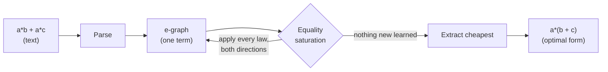

<div align="center">

# 🧵 Logic-Loom

### A compiler that understands *mathematics*, not just instructions.

*Most optimizers shuffle instructions. Logic-Loom reasons about algebra —
it discovers that `a*b + a*c` **is** `a*(b + c)`, finds Horner's scheme on
its own, and cancels `a*(b+c) - a*b` down to `a*c`.*

[Quick start](#-quick-start) ·
[Showcase](#-showcase) ·
[How it works](#-how-it-works) ·
[Write your own rules](#-teach-it-new-mathematics) ·
[Why it's correct](#-why-its-correct)

</div>

---

## The idea

A traditional compiler optimizes by pattern-matching *instructions*: replace a
multiply-by-2 with a shift, fold two constants, peephole away a redundant move.
It reads code like a clerk with a checklist.

Logic-Loom reads code like a **mathematician**. Given

```
a*b + a*c
```

it doesn't ask *"which instruction is cheaper?"* — it recognizes the
**distributive law** and rewrites the algorithm:

```
a*(b + c)        # one multiply instead of two
```

It does this not with a hand-written `if` for every case, but by knowing a
handful of algebraic *laws* and **exploring all of their consequences at once**,
then picking the cheapest equivalent form. The same engine that factors a sum
also discovers Horner's scheme for polynomials and cancels terms that destroy
each other — none of which were special-cased.

> **The technique:** *equality saturation* over an *e-graph* — the same idea
> behind [`egg`](https://egraphs-good.github.io/) and the
> [Herbie](https://herbie.uwplse.org/) floating-point optimizer. See
> [How it works](#-how-it-works).

---

## 🚀 Quick start

No dependencies. Pure Python (3.9+).

```bash
git clone https://github.com/elianalfonsolopezpreciado/Logic-Loom.git
cd Logic-Loom

# run the showcase
python examples/demo.py

# or optimize from the command line
python -m logic_loom "a*b + a*c"
#  a * b + a * c  =>  (c + b) * a
#    cost 5.4 -> 3.3  (1.64x)
```

From Python:

```python
from logic_loom import optimize

r = optimize("a*x*x + b*x + c")
print(r.optimized)        # x * (a * x + b) + c     <- Horner's scheme!
print(r.speedup)          # 1.32
```

Install it as a package (optional):

```bash
pip install -e .
logic-loom "p*q + p*r + p*s"
```

---

## ✨ Showcase

Every row below is produced by the **same** engine and the **same** rule set —
nothing is special-cased. `cost` is the weighted operation count (multiplies
cost more than adds, divisions and powers more still).

| Input | Logic-Loom output | What it figured out | Cost |
|---|---|---|---|
| `a*b + a*c` | `(c + b) * a` | distributive law / factoring | 5.4 → 3.3 |
| `p*q + p*r + p*s` | `(s + (r + q)) * p` | factor a term shared by 3 products | 8.6 → 4.4 |
| `a*x*x + b*x + c` | `x * (a*x + b) + c` | **Horner's scheme, discovered** | 8.6 → 6.5 |
| `a*(b + c) - a*b` | `c * a` | expand, then cancel `a*b` | 6.5 → 2.2 |
| `2*3 + 4*x*0 + a*1` | `a + 6` | constant folding + identities | 10.7 → 1.2 |
| `2*x + 3*x` | `5 * x` | combine like terms | 5.4 → 2.2 |
| `x + 0 - x + 5` | `5` | self-inverse vanishes | 3.4 → 0.1 |
| `x/x + y - y` | `1` | division & subtraction cancel | 6.4 → 0.1 |
| `(a+b)/c + (a-b)/c` | `(a + a) / c` | combine over a denominator | 11.6 → 5.3 |

Run `python examples/demo.py` to reproduce all of these with live statistics.

---

## 🧠 How it works

The magic is that Logic-Loom never commits to a single rewrite. A greedy
compiler that applies `factor` too early can miss a better form that needed
`distribute` first. Logic-Loom sidesteps this **phase-ordering problem**
entirely by keeping *every* equivalent form alive simultaneously.



**1. The e-graph.** An *e-graph* is a data structure that stores a huge set of
equivalent expressions compactly. Terms that are known to be equal are grouped
into an *e-class*; an *e-node* is an operator applied to e-*classes* (not to
concrete terms). So a single `+` node over the classes `{a*b}` and `{a*c}`
already represents *every* term those classes contain.

**2. Equality saturation.** We repeatedly apply algebraic laws as *rewrites*
that **add** equalities instead of replacing terms:

```
distribute :  ?a * (?b + ?c)  ==  ?a*?b + ?a*?c
factor     :  ?a*?b + ?a*?c   ==  ?a * (?b + ?c)
comm-add   :  ?a + ?b         ==  ?b + ?a
assoc-mul  :  (?a*?b)*?c      ==  ?a*(?b*?c)
self-mul   :  ?a * ?a         ==  ?a ^ 2
...        (see logic_loom/rules.py)
```

Because rewrites only *add* information, contradictory-looking rules
(`distribute` **and** `factor`) coexist happily and the result is independent of
the order rules fire in. We keep going until applying the laws teaches us
nothing new — the graph is **saturated** — or a resource limit is reached.

**3. Extraction.** The saturated graph now contains all discovered forms. A
small [cost model](logic_loom/cost.py) assigns each operator a weight, and a
fixed-point picks the cheapest representative of each e-class. *That* extracted
term is the answer.

Change the weights and "optimal" changes with them: make `^` cheap and
`x*x*x` becomes `x^3`; make it expensive and it stays as multiplications.

---

## 🧩 Teach it new mathematics

Rules are one-liners. Add a law and the engine immediately exploits it
everywhere — combined with every other law, in both directions:

```python
from logic_loom import optimize, rule, DEFAULT_RULES

power_of_two = rule("pow2", "?x ^ 2", "?x * ?x")

r = optimize("(a + b) ^ 2", rules=DEFAULT_RULES + [power_of_two])
print(r.optimized)
```

A rule is just `rule(name, left_pattern, right_pattern)`, where `?name` marks a
pattern variable. You are describing a *theorem*, not a procedure — Logic-Loom
decides when and where it pays off.

---

## ✅ Why it's correct

A clever optimizer is worthless if it's ever *wrong*. Logic-Loom is backed by
**differential testing**: for each example we evaluate the original and the
optimized expression on hundreds of random inputs and assert they agree to
floating-point tolerance (`tests/test_equivalence.py`).

```bash
pip install pytest
pytest -q          # 22 passed
```

The suite checks parsing, every class of optimization, and — most importantly —
that **no rewrite ever changes what an expression computes**.

---

## 🗺️ Architecture

A compact, readable codebase — the whole engine is a few hundred lines.

| File | Responsibility |
|---|---|
| [`logic_loom/expr.py`](logic_loom/expr.py) | the expression AST + pretty-printer + numeric evaluator |
| [`logic_loom/parser.py`](logic_loom/parser.py) | Pratt parser (precedence, unary minus, calls, `?patvars`) |
| [`logic_loom/egraph.py`](logic_loom/egraph.py) | the e-graph: union-find, hashcons, congruence `rebuild` |
| [`logic_loom/rules.py`](logic_loom/rules.py) | rewrite rules + e-matching |
| [`logic_loom/saturate.py`](logic_loom/saturate.py) | the equality-saturation loop + constant folding |
| [`logic_loom/cost.py`](logic_loom/cost.py) | cost model + cheapest-term extraction |
| [`logic_loom/compiler.py`](logic_loom/compiler.py) | the high-level `optimize()` API |
| [`logic_loom/cli.py`](logic_loom/cli.py) | the `python -m logic_loom` command line |

---

## ⚖️ Honest limitations

This is a focused demonstration of a powerful idea, not a production CAS.

- **Associativity + commutativity explode.** The space of "equal" forms over
  AC operators grows super-exponentially. Like every real e-graph engine,
  Logic-Loom bounds this with iteration and node limits (`--node-limit`); on
  hard inputs it stops early but still extracts the best form *found so far*.
- **Domain.** It reasons over real-valued arithmetic. Rules like `x/x = 1`
  assume `x ≠ 0`, which is fine for the symbolic demo but would need guards for
  a sound floating-point pipeline.
- **Cost model is illustrative.** The weights in `cost.py` are a stand-in for
  real hardware costs; swap in a measured model for serious use.

---

## 📚 Further reading

- M. Willsey et al., **“egg: Fast and Extensible Equality Saturation,”** *POPL 2021* — the modern reference for e-graphs and equality saturation.
- R. Tate et al., **“Equality Saturation: A New Approach to Optimization,”** *POPL 2009*.
- **Herbie** — equality saturation applied to floating-point accuracy: <https://herbie.uwplse.org/>
- **egg / egglog** — <https://egraphs-good.github.io/>

---

<div align="center">

Built as an exploration of what a compiler looks like when it thinks like a
mathematician. **MIT licensed** — see [LICENSE](LICENSE).

</div>
