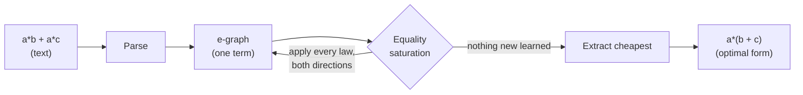

<div align="center">

# Logic-Loom

### A compiler that understands *mathematics*, not just instructions.

Most optimizers shuffle instructions. Logic-Loom reasons about algebra. It
discovers that `a*b + a*c` **is** `a*(b + c)`, finds Horner's scheme on its
own, cancels `a*(b+c) - a*b` down to `a*c`, and can emit the result as C,
Rust or JavaScript.

[Quick start](#quick-start) ·
[Showcase](#showcase) ·
[How it works](#how-it-works) ·
[Code generation](#code-generation) ·
[Extended domain](#extended-domain-transcendental-functions) ·
[Correctness](#correctness) ·
[Limitations](#limitations) ·
[Roadmap](#roadmap)

</div>

---

## The idea

A traditional compiler optimizes by pattern-matching *instructions*: replace a
multiply-by-two with a shift, fold two constants, peephole away a redundant
move. It reads code like a clerk with a checklist.

Logic-Loom reads code like a **mathematician**. Given

```
a*b + a*c
```

it does not ask *"which instruction is cheaper?"* It recognizes the
**distributive law** and rewrites the algorithm:

```
a*(b + c)        # one multiply instead of two
```

It does this not with a hand-written branch for every case, but by knowing a
handful of algebraic *laws* and exploring all of their consequences at once,
then picking the cheapest equivalent form. The same engine that factors a sum
also discovers Horner's scheme for polynomials and cancels terms that destroy
each other; none of it was special-cased.

> **The technique:** *equality saturation* over an *e-graph*, the same idea
> behind [`egg`](https://egraphs-good.github.io/) and the
> [Herbie](https://herbie.uwplse.org/) floating-point optimizer. See
> [How it works](#how-it-works).

---

## Quick start

No dependencies. Pure Python (3.9+).

```bash
git clone https://github.com/elianalfonsolopezpreciado/Logic-Loom.git
cd Logic-Loom

# run the showcase
python examples/demo.py

# optimize from the command line
python -m logic_loom "a*b + a*c"
#  a * b + a * c  =>  a * (b + c)
#    cost 5.4 -> 3.3  (1.64x)

# optimize and emit code
python -m logic_loom --lang rust "a*x*x + b*x + c"
#  a * x * x + b * x + c  =>  x * (a * x + b) + c
#    rust: x * (a * x + b) + c
```

From Python:

```python
from logic_loom import optimize, to_code

r = optimize("a*x*x + b*x + c")
print(r.optimized)              # x * (a * x + b) + c     <- Horner's scheme
print(r.speedup)               # 1.32
print(to_code(r.optimized, "c"))
```

Install it as a package (optional):

```bash
pip install -e .
logic-loom "p*q + p*r + p*s"
```

---

## Showcase

Every row below is produced by the **same** engine and the **same** rule set;
nothing is special-cased. `cost` is the weighted operation count (multiplies
cost more than adds, divisions and powers more still).

| Input | Logic-Loom output | What it figured out | Cost |
|---|---|---|---|
| `a*b + a*c` | `a * (b + c)` | distributive law / factoring | 5.4 -> 3.3 |
| `p*q + p*r + p*s` | `p * (q + (r + s))` | factor a term shared by three products | 8.6 -> 4.4 |
| `a*x*x + b*x + c` | `x * (a*x + b) + c` | **Horner's scheme, discovered** | 8.6 -> 6.5 |
| `a*(b + c) - a*b` | `a * c` | expand, then cancel `a*b` | 6.5 -> 2.2 |
| `2*3 + 4*x*0 + a*1` | `6 + a` | constant folding + identities | 10.7 -> 1.2 |
| `2*x + 3*x` | `x * 5` | combine like terms | 5.4 -> 2.2 |
| `x + 0 - x + 5` | `5` | self-inverse vanishes | 3.4 -> 0.1 |
| `x/x + y - y` | `1` | division and subtraction cancel | 6.4 -> 0.1 |
| `(a+b)/c + (a-b)/c` | `(a + a) / c` | combine over a denominator | 11.6 -> 5.3 |

Run `python examples/demo.py` to reproduce all of these with live statistics.

---

## How it works

The key insight is that Logic-Loom never commits to a single rewrite. A greedy
compiler that applies `factor` too early can miss a better form that needed
`distribute` first. Logic-Loom sidesteps this **phase-ordering problem**
entirely by keeping *every* equivalent form alive simultaneously.



**1. The e-graph.** An *e-graph* is a data structure that stores a large set of
equivalent expressions compactly. Terms known to be equal are grouped into an
*e-class*; an *e-node* is an operator applied to e-*classes* rather than to
concrete terms. So a single `+` node over the classes `{a*b}` and `{a*c}`
already represents *every* term those classes contain.

**2. Equality saturation.** Algebraic laws are applied as *rewrites* that
**add** equalities instead of replacing terms:

```
distribute :  ?a * (?b + ?c)  ==  ?a*?b + ?a*?c
factor     :  ?a*?b + ?a*?c   ==  ?a * (?b + ?c)
comm-add   :  ?a + ?b         ==  ?b + ?a
assoc-mul  :  (?a*?b)*?c      ==  ?a*(?b*?c)
self-mul   :  ?a * ?a         ==  ?a ^ 2
...        (see logic_loom/rules.py)
```

Because rewrites only *add* information, contradictory-looking rules
(`distribute` **and** `factor`) coexist without looping, and the result is
independent of the order in which rules fire. The engine continues until the
laws teach it nothing new (the graph is **saturated**) or a resource limit is
reached.

**3. Extraction.** The saturated graph now contains all discovered forms. A
small [cost model](logic_loom/cost.py) assigns each operator a weight, and a
fixed-point picks the cheapest representative of each e-class. That extracted
term is the answer.

Change the weights and "optimal" changes with them: make `^` cheap and `x*x*x`
becomes `x^3`; make it expensive and it stays as multiplications.

**4. Smarter limits.** Associative and commutative rules can match thousands of
times per round and swamp the useful rewrites. Logic-Loom includes a
[backoff scheduler](logic_loom/saturate.py) (after egg's `BackoffScheduler`):
when a rule exceeds its match budget it is *temporarily banned*, and its budget
then doubles, so a genuinely productive rule is delayed but never silenced. A
hard node cap remains as the final guarantee of termination. Pass `--verbose`
to see which rules were throttled.

---

## Code generation

Optimizing an expression is only useful if you can run it. Logic-Loom emits the
optimized form as real source code in C, Rust or JavaScript:

```bash
python -m logic_loom --lang c    "a*x*x + b*x + c"   # x * (a * x + b) + c
python -m logic_loom --lang rust "x ^ 3"             # (x).powf(3)
python -m logic_loom --lang js   "exp(a) * exp(b)" --extended
```

```python
from logic_loom import optimize, to_code

e = optimize("sqrt(x)*sqrt(x) + exp(a)", rules=...).optimized
to_code(e, "rust")   # 'a.exp() + x'
to_code(e, "js")     # 'Math.exp(a) + x'
```

Power and function calls are rendered idiomatically per language (`pow` /
`Math.pow` / `.powf`, `Math.exp` / `.exp()`, and so on).

---

## Extended domain: transcendental functions

By default Logic-Loom reasons over polynomial/rational arithmetic. The
`--extended` flag (or `rules=ALL_RULES`) adds identities for exponentials,
logarithms, square roots and trigonometry, each validated numerically in the
test-suite:

| Input | Output | Identity used |
|---|---|---|
| `exp(a) * exp(b)` | `exp(a + b)` | product of exponentials |
| `log(exp(x))` | `x` | log and exp are inverse |
| `sin(x)^2 + cos(x)^2` | `1` | Pythagorean identity |
| `sqrt(x) * sqrt(x)` | `x` | square root squared |

These assume the usual real domains (for example `log` and `sqrt` of a positive
argument), which is why they are opt-in rather than always on.

---

## Visualize the e-graph

To see what saturation actually explores, export the e-graph to Graphviz:

```bash
python -m logic_loom --dot "a*b + a*c" > egraph.dot
dot -Tsvg egraph.dot -o egraph.svg
```

Each dashed box is an e-class (a set of forms proven equal); nodes inside it are
the different ways to build a value in that class; edges point from an operator
to the classes of its operands.

---

## Teach it new mathematics

Rules are one-liners. Add a law and the engine immediately exploits it
everywhere, combined with every other law, in both directions:

```python
from logic_loom import optimize, rule, DEFAULT_RULES

power_of_two = rule("pow2", "?x ^ 2", "?x * ?x")

r = optimize("(a + b) ^ 2", rules=DEFAULT_RULES + [power_of_two])
print(r.optimized)
```

A rule is `rule(name, left_pattern, right_pattern)`, where `?name` marks a
pattern variable. You are describing a *theorem*, not a procedure; Logic-Loom
decides when and where it pays off.

---

## Correctness

A clever optimizer is worthless if it is ever *wrong*. Logic-Loom is backed by
**differential testing**: for each example the original and optimized
expressions are evaluated on hundreds of random inputs and asserted to agree to
floating-point tolerance (`tests/test_equivalence.py`,
`tests/test_extended.py`).

```bash
pip install pytest
pytest -q          # 37 passed
```

The suite covers parsing, code generation, every class of optimization, and,
most importantly, that **no rewrite ever changes what an expression computes**.

---

## Architecture

A compact, readable codebase; the whole engine is a few hundred lines.

| File | Responsibility |
|---|---|
| [`logic_loom/expr.py`](logic_loom/expr.py) | expression AST, pretty-printer, numeric evaluator |
| [`logic_loom/parser.py`](logic_loom/parser.py) | Pratt parser (precedence, unary minus, calls, `?patvars`) |
| [`logic_loom/egraph.py`](logic_loom/egraph.py) | the e-graph: union-find, hashcons, congruence `rebuild` |
| [`logic_loom/rules.py`](logic_loom/rules.py) | rewrite rules (default + extended) and e-matching |
| [`logic_loom/saturate.py`](logic_loom/saturate.py) | equality-saturation loop, constant folding, backoff scheduler |
| [`logic_loom/cost.py`](logic_loom/cost.py) | cost model and cheapest-term extraction |
| [`logic_loom/codegen.py`](logic_loom/codegen.py) | emit C / Rust / JavaScript |
| [`logic_loom/viz.py`](logic_loom/viz.py) | Graphviz DOT export of the e-graph |
| [`logic_loom/compiler.py`](logic_loom/compiler.py) | the high-level `optimize()` API |
| [`logic_loom/cli.py`](logic_loom/cli.py) | the `python -m logic_loom` command line |

---

## Limitations

This is a focused, working demonstration of a powerful idea, not a
production-grade computer algebra system. The current boundaries are explicit:

- **Restricted domain.** The engine reasons over real-valued arithmetic.
  Division by zero, discontinuous functions, and floating-point rounding
  effects are *not* modeled; rules such as `x/x = 1` assume `x != 0` and the
  transcendental rules assume the natural real domains. A sound
  floating-point pipeline would need explicit domain guards on each rule.

- **Combinatorial explosion.** Over associative and commutative operators the
  number of "equal" forms grows super-exponentially. The backoff scheduler and
  node cap keep this bounded and guarantee termination, but on inputs with many
  variables and AC operations the search can stop early at a resource limit,
  which means the *globally* optimal form is not guaranteed; Logic-Loom returns
  the best form found within the budget.

- **Illustrative cost model.** The operator weights in `cost.py` are a
  stand-in, not a faithful model of any real CPU or GPU. They are good enough to
  demonstrate cost-driven extraction but should be replaced by a measured model
  before drawing performance conclusions.

- **No integration with existing toolchains.** Logic-Loom is a standalone
  engine. It is not yet wired into a production compiler (such as LLVM) or used
  as an optimization backend for an existing language, which limits drop-in
  practical adoption today.

- **Limited depth of documentation for non-technical users.** There is a
  showcase and a clear file map, but advanced usage and tutorial-style material
  are still thin, which can raise the barrier for newcomers.

- **Not a full CAS.** This is deliberately a *demonstrator* of the idea, not a
  complete symbolic-mathematics system; it does not aim to solve equations,
  integrate, or simplify across the full breadth a CAS would.

---

## Roadmap

Directions for turning the demonstrator into something broader. Items marked
**(done)** already ship in this repository; the rest are open and well-scoped.

- **Broader domains (done, expanding).** Rules for non-algebraic functions
  (trigonometric, exponential, logarithmic) with numeric validation are
  implemented behind `--extended`; the next step is widening coverage and
  adding domain guards.
- **Code generation in multiple languages (done, expanding).** Optimized
  expressions can be emitted as C, Rust and JavaScript; more targets and full
  statement/function emission are natural extensions.
- **Smarter limits (done, expanding).** A backoff scheduler already throttles
  explosive AC rules dynamically; richer heuristics (cost-aware scheduling,
  e-class size analysis) are the next refinement.
- **e-graph visualization (done, expanding).** DOT export exists; an
  interactive viewer that animates saturation round by round would make the
  process far easier to understand.
- **More realistic cost model.** Incorporate hardware-specific costs (modern
  CPUs, GPUs) instead of the illustrative weights, ideally from measurement.
- **Integration with programming languages.** Build a plugin for an existing
  compiler (such as LLVM) or expose Logic-Loom as an optimization backend a
  language can call into.
- **Side effects and impurity.** The engine currently assumes pure
  expressions; extending it to handle ordering and side effects is an
  interesting and challenging direction.

---

## Further reading

- M. Willsey et al., *"egg: Fast and Extensible Equality Saturation,"* POPL 2021 - the modern reference for e-graphs and equality saturation.
- R. Tate et al., *"Equality Saturation: A New Approach to Optimization,"* POPL 2009.
- **Herbie** - equality saturation applied to floating-point accuracy: <https://herbie.uwplse.org/>
- **egg / egglog** - <https://egraphs-good.github.io/>

---

<div align="center">

Built as an exploration of what a compiler looks like when it thinks like a
mathematician. MIT licensed; see [LICENSE](LICENSE).

</div>
